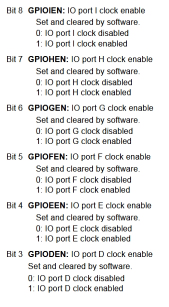
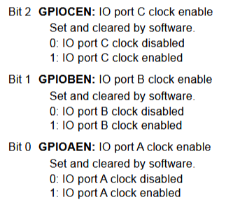
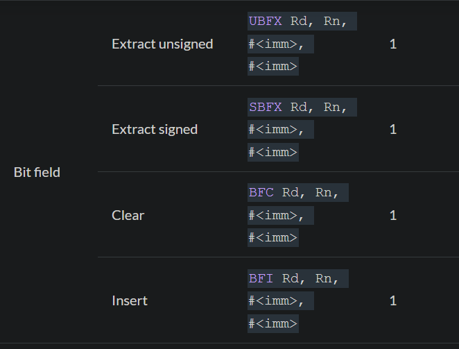

# ARM Assembly

- [ARM Assembly](#arm-assembly)
  - [EasyMX Driver Installation](#easymx-driver-installation)
  - [Keil Installation](#keil-installation)
  - [Project Creation](#project-creation)
  - [Code Structure](#code-structure)
    - [ARM Assembly in General](#arm-assembly-in-general)
    - [STM Operation](#stm-operation)
    - [General Code Structure](#general-code-structure)
    - [Initialization](#initialization)
      - [Ports](#ports)
        - [Mode Register](#mode-register)
        - [Output Type Register](#output-type-register)
        - [Output Speed Register](#output-speed-register)
        - [Pull-up / Pull-down Register](#pull-up--pull-down-register)
        - [Output Register](#output-register)
      - [Clock](#clock)
      - [Example](#example)
    - [Bit Operations](#bit-operations)
  - [Using TFT](#using-tft)
  - [Simulation](#simulation)
  - [Flashing](#flashing)

## EasyMX Driver Installation

1. Install the STM driver (`ST-Link`), a general driver for any STM debugger, using [Mikro Website](https://www.mikroe.com/easymx-pro-stm32#idTabFSCHT1310) or [ARM Website](https://os.mbed.com/teams/ST/wiki/ST-Link-Driver).
2. Install `MikroProg Suite` for flashing code.
3. Connect the board and check the connection using `MikroProg Suite`.

**Note:** The board has multiple USB ports. Connect to the one closest to the debugger (MikroProg port).

## Keil Installation

Keil can simulate and flash code on STM chips (if a programmer is available). It also supports startup code for STM32 chips (bootstrap) and different compilers for C++, C, and Assembly.

1. Download Keil uVision (also called MDK-ARM) from the [Official Website](https://www.keil.com/demo/eval/arm.htm).
2. Download and Install the STM32F407VG package v2.17.1 from [here](https://www.keil.com/pack/Keil.STM32F4xx_DFP.2.17.1.pack)

## Project Creation

1. Open Keil uVision.
2. Create a new project (`Project > Create New uVision Project`).
3. In the Packs section, select STM32F407VG as the target.
4. In the runtime environment, select:
    - **CMSIS > Core**
    - **Device > Startup**
5. Click on `Options for Target` > `Debugger` > select "ST-Link Debugger".
6. Start coding, compiling, building, and flashing.

**Note:** After flashing, if the code does not start, reset the board.

## Code Structure

### ARM Assembly in General

1. `.data .code .stack` in x86 Assembly are written as `AREA <Area Name>, [CODE/DATA], [READONLY/READWRITE]` in ARM.

    - ARM assembly can have different areas for code containing different functions, but it always starts from `main`.
    - Some assemblers accept writing data in code without defining a specific data area.
    - `READONLY` areas are written to flash memory, which is not writable at runtime.
    - `READWRITE` areas are written to RAM.

2. The `Link Register (LR)` does **not** act as the `Instruction Pointer (IP)`. Instead:
    - **PC (Program Counter)** is the actual instruction pointer.
    - **LR (Link Register)** stores the return address when a function is called.

3. `CALL` and `RET` instructions (which exist in x86) do not exist in ARM. Instead, ARM uses:
    - **Branch and Link (`BL`)** for calling functions/procedures.
    - **Branch Exchange (`BX LR`)** for returning.

   ```assembly
   BL my_function   ; Calls my_function, storing return address in LR
   BX LR            ; Returns to the caller
   ```

4. ARM has **Procedures** and **Functions**.

   - Conceptually:
     - `Functions` return a value.
     - `Procedures` may perform actions but do not necessarily return a value.
     - **All functions are procedures, but not all procedures are functions.**

   Example of a procedure:

   ```assembly
   procedure_example:
       PUSH {R4, LR}   ; Save R4 and LR
       MOV R0, #5      ; Example operation
       MOV R1, #10     ; Another operation
       POP {R4, LR}    ; Restore R4 and LR
       BX LR           ; Return to caller
   ```

   Example of a function:

   ```assembly
   function_example:
       PUSH {R4, LR}   ; Save R4 and LR
       MOV R4, #20
       ADD R0, R0, R4  ; Modify R0
       MOV R0, #10     ; Return value
       POP {R4, LR}    ; Restore R4 and LR
       BX LR           ; Return to caller
   ```

5. To use functions from another file in ARM Assembly, use:

   ```assembly
   EXPORT <function_name>  ; Export function for external use
   INCLUDE <filename>      ; Include another assembly file
   ```

6. `END MAIN` in x86 Assembly is simply written as `END` in ARM.

### STM Operation  

ARM's startup code (provided by STMicroelectronics) calls the `__main` function, which should contain all the necessary code.

### General Code Structure

```assembly
    EXPORT __main

    AREA MYDATA, DATA, READWRITE  ; Read-Write data section (written to RAM)

    ; Data

    AREA MYCODE, CODE, READONLY ; Read-only data section (written to flash or ROM)
        
__main FUNCTION

    ; Code
    
    ENDFUNC
    
    END
```

### Initialization

All registers are memory-mapped (accessed using `LDR` and `STR`).

#### Ports

Each pin is represented by a bit in a port. Ports have `control registers` and `data registers`.

**Control Registers (32-bit):**

- `GPIOx_MODER`: Selects the I/O direction.
- `GPIOx_OTYPER`: Selects the output type (push-pull or open-drain).
- `GPIOx_OSPEEDR`: Selects pin speed.
- `GPIOx_PUPDR`: Selects the pull-up/pull-down configuration.

**Data Registers (16-bit):**

- `GPIOx_IDR`: Stores input data (read-only).
- `GPIOx_ODR`: Stores output data (read/write).

Each register has the same offset regardless of the segment it exists in:

**Control Registers:**

- `GPIOx_MODER`: `0x00`
- `GPIOx_OTYPER`: `0x04`
- `GPIOx_OSPEEDR`: `0x08`
- `GPIOx_PUPDR`: `0x0C`

**Data Registers:**

- `GPIOx_IDR`: `0x10`
- `GPIOx_ODR`: `0x14`

According to the STM32F4XX datasheet:


All GPIO ports are connected to `AHB1` Bus but each having its segment
```assembly
GPIOD_MODER   EQU  0x40020C00
GPIOD_OTYPER  EQU  0x40020C04
GPIOD_OSPEEDR EQU  0x40020C08
GPIOD_PUPDR   EQU  0x40020C0C
GPIOD_ODR     EQU  0x40020C14
```

##### Mode Register


Each port pin is associated with two bits in the mode register:

- `00` - Input mode
- `01` - Output mode
- `10` - Analog mode
- `11` - Alternate function

##### Output Type Register


Configures output pins as either push-pull or open-drain.

- `0`: Push-pull
- `1`: Open-drain

##### Output Speed Register


Determines the maximum switching speed of the port pins.

- `00`: Slow speed (2MHz to 8MHz)

##### Pull-up / Pull-down Register


Configures the internal pull-up or pull-down resistors for each pin.

- `00` - No pull up / pull down
- `01` - Pull up
- `10` - Pull down
- `11` - reserved

##### Output Register

A simple register with `1` for ON and `0` for OFF.

#### Clock

To use ports or pins, we must first enable the clock for the corresponding port.

To enable clock on ports on `AHB1` Bus use register `RCC_AHB1ENR   EQU  0x40023830`:

```assembly
RCC_AHB1ENR   EQU  0x40023830
```

>This register is part of the RCC registers (Reset and Clock Control). The offset of this register is `0x30` as described in section 7.3.10 of the reference manual. The memory map shows the RCC boundary address range as `0x4002 3800` to `0x4002 3BFF`. Therefore, the address of the `RCC_AHB1ENR` register is `0x4002 3830`.





#### Example

```assembly
LDR    R1,  =RCC_AHB1ENR    ; Load address of clock register
LDR    R0,  [R1]            ; Load value from clock register
ORR.W  R0,  #0x08           ; ORR.W = logical OR for words
STR    R0,  [R1]            ; Store updated value back to register
```

### Bit Operations

In arm assembly bit operations are easy using BFI, BFC instructions



## Using TFT

TFT connections on EasyMX board:

```text
+--------- TFT ---------+
|      D0   ←  PE0      |
|      D1   ←  PE1      |
|      D2   ←  PE2      |
|      D3   ←  PE3      |
|      D4   ←  PE4      |
|      D5   ←  PE5      |
|      D6   ←  PE6      |
|      D7   ←  PE7      |
|-----------------------|
|      RST  ←  PE8      |
|      BCK  ←  PE9      |
|      RD   ←  PE10     |
|      WR   ←  PE11     |
|      RS   ←  PE12     |
|      CS   ←  PE15     |
+-----------------------+
   TFT Mapping EasyMX
```

## Simulation

To simulate the code, debug it in Keil.

## Flashing

To flash the code onto the target:

1. Ensure the target is connected via `MikroProg Suite`.
2. Flash the code using Keil uVision.
