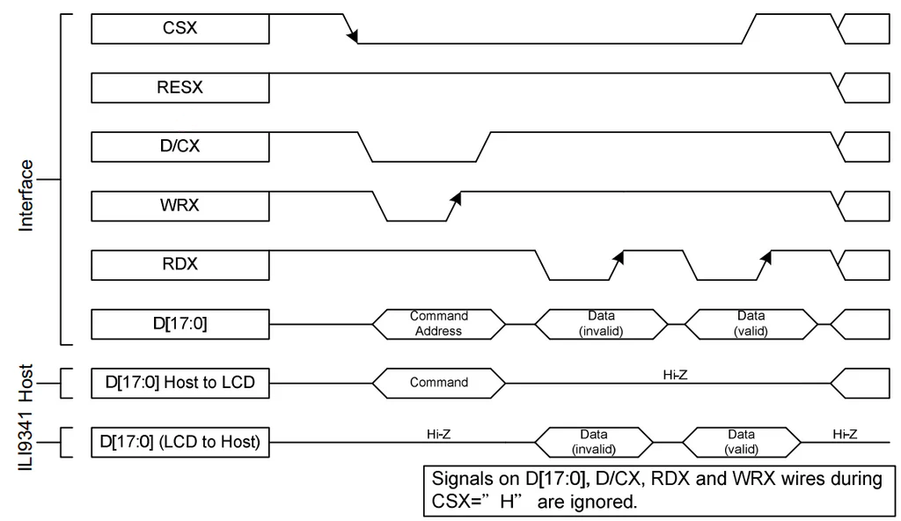

# ARM Assembly


- [ARM Assembly](#arm-assembly)
  - [Introduction](#introduction)
  - [Prerequisites](#prerequisites)
  - [Preparing Simulation Environment](#preparing-simulation-environment)
    - [Proteus Installation](#proteus-installation)
      - [Using Proteus](#using-proteus)
    - [Keil Installation](#keil-installation)
      - [Project Creation](#project-creation)
  - [Hardware Refresher](#hardware-refresher)
    - [Hardware Introduction](#hardware-introduction)
    - [Microcontrollers](#microcontrollers)
      - [Mode Register](#mode-register)
      - [Output Type Register](#output-type-register)
      - [Output Speed Register](#output-speed-register)
      - [Pull-up / Pull-down Register](#pull-up--pull-down-register)
      - [Data Registers: Output Register and Input Register](#data-registers-output-register-and-input-register)
    - [TFT LCDs](#tft-lcds)
    - [Interfacing Between STM32 and TFT Display](#interfacing-between-stm32-and-tft-display)
    - [8080 Parallel Interface](#8080-parallel-interface)
      - [Pin Configuration](#pin-configuration)
      - [Write Cycle](#write-cycle)
      - [Read Cycle](#read-cycle)
    - [Display Initialization](#display-initialization)
    - [Drawing](#drawing)
      - [Steps to Draw on the TFT Screen](#steps-to-draw-on-the-tft-screen)
  - [Code Structure](#code-structure)
    - [ARM Assembly in General](#arm-assembly-in-general)
    - [Differences Between ARM and x86 Assembly](#differences-between-arm-and-x86-assembly)
    - [STM Operation](#stm-operation)
    - [General Code Structure](#general-code-structure)
    - [Initialization](#initialization)
      - [Ports](#ports)
    - [Memory-Mapped GPIO Registers in STM32F407VG and STM32F103C6](#memory-mapped-gpio-registers-in-stm32f407vg-and-stm32f103c6)
      - [STM32F407VG GPIO Memory Map](#stm32f407vg-gpio-memory-map)
      - [STM32F103C6 GPIO Memory Map](#stm32f103c6-gpio-memory-map)
      - [Key Differences Between STM32F407VG and STM32F103C6 GPIO](#key-differences-between-stm32f407vg-and-stm32f103c6-gpio)
  - [Bit Operations and Bitmasking in ARM Assembly](#bit-operations-and-bitmasking-in-arm-assembly)
    - [Understanding Bit Operations](#understanding-bit-operations)
    - [Bitmasking](#bitmasking)
      - [Bitmask](#bitmask)
      - [1. ORR (Logical OR) - Setting a Bit](#1-orr-logical-or---setting-a-bit)
      - [2. BIC (Bit Clear) - Clearing a Bit](#2-bic-bit-clear---clearing-a-bit)
      - [3. BFI (Bit Field Insert) - Inserting a Bit Field (ARMv7 and Later)](#3-bfi-bit-field-insert---inserting-a-bit-field-armv7-and-later)
      - [4. BFC (Bit Field Clear) - Clearing a Bit Field (ARMv7 and Later)](#4-bfc-bit-field-clear---clearing-a-bit-field-armv7-and-later)
    - [Summary of Bit Operations](#summary-of-bit-operations)
    - [Clock](#clock)
      - [Example](#example)
  - [ARM Assembly Examples](#arm-assembly-examples)
    - [Simulation](#simulation)
      - [Filling the TFT Display with Color](#filling-the-tft-display-with-color)
    - [Hardware](#hardware)
      - [Button-Triggered LED](#button-triggered-led)
      - [LED Blink](#led-blink)
  - [Preparing Hardware Environment](#preparing-hardware-environment)
    - [EasyMX Driver Installation](#easymx-driver-installation)
    - [Flashing](#flashing)

## Introduction

In this guide, I aim to explain how to write, compile, and test ARM Assembly code. I am writing code using **Keil MDK** (of course, you can use `STM32CubeIDE` or any other IDE). I am testing the code using simulation first (with `Proteus`), then on hardware (using `EasyMX Pro v7 for STM`).  

I am writing for both the `BluePill STM32F103C6` and the `EasyMX STM32F407VG` interchangeably, as they are quite similar. I chose the `BluePill STM32F103C6` because it is the most popular `STM32` microcontroller and the `EasyMX STM32F407VG` because I have it.  

## Prerequisites  

I assume you have prior experience with **x86 Assembly programming**.  

## Preparing Simulation Environment

### Proteus Installation  

For simulation, we use `Proteus V8.16`. No extra libraries are needed, as it already includes `STM32` parts, buttons, LEDs, and TFT LCDs.  

Install `Proteus` as usual, ensure it is working properly, and verify that it contains the required components.  

#### Using Proteus

1. Create New Project with `Default Schematic` template but with PCB Layout or Firmware
2. Add `Power` and `Ground` from `Terminals` list on the side bar
   1. Set `Power` value by double click and writing label as `+3.3v` for 3.3 volts
3. Open parts library (press `p` or open `Library` > `Pick Parts`) and search for any needed parts
4. Connect parts by extending wires using mouse dragging
5. If your simulation contains Micro-controllers
   1. Double click the Micro-controllers
   2. Check that `Crystal Frequency` is set. For example: `16MHz` or `16M`
   3. Choose code file as the HEX file generated from the compiler
6. Run the simulation


### Keil Installation  

Keil can simulate and flash code to STM chips (if a hardware programmer is available). It also provides startup code (bootstrap) for STM32 chips and supports different compilers for C++, C, and Assembly.  

1. Download **Keil uVision** (also called **MDK-ARM**) from the [official website](https://www.keil.com/demo/eval/arm.htm).  
2. **For BluePill**: Download and install the `STM32F103C6` package from the **Packs Installer** in Keil. Only the **DFP pack** is needed.  
3. **For EasyMX**: Download and install the `STM32F407VG` package (v2.17.1) from [this link](https://www.keil.com/pack/Keil.STM32F4xx_DFP.2.17.1.pack).  

#### Project Creation  

1. Open **Keil uVision**.  
2. Create a new project (**Project** > **Create New uVision Project**).  
3. In the **Packs** section, select `STM32F407VG` or `STM32F103C6` as the target.  
4. In the **Runtime Environment**, select:  
    - **CMSIS > Core**  
    - **Device > Startup**  
5. **For Hardware:** Click on **Options for Target** > **Debugger** > select **ST-Link Debugger**.  
6. **For Simulation:** Click on **Options for Target** > **Output** > check **"Create HEX File"**.  
7. Start coding, compiling, and building.  

**Note:** Code can be simulated at the register level by debugging in Keil.  

## Hardware Refresher

### Hardware Introduction  

Most microcontrollers, such as `STM32`, `ESP`, and `AVR (Arduino)`, operate with similar concepts. Here, we will review some of these concepts to help you understand how our code will work.  

### Microcontrollers  

Most microcontroller boards have external pins to connect them to other devices. To use these pins, we must:  

1. Configure which pins are used as outputs and which as inputs.  
2. Configure whether input pins have pull-up or pull-down resistors.  
3. Implement a method to write to output pins.  
4. Implement a method to read input pins.  
5. Apply all other necessary configurations.  

All these configurations are stored in registers. Every group of pins is called a **Port**, and each port has a set of registers for configuring its pins.  

For example, the `STM32F407VG` has **five ports**. Each port has **control registers** and **data registers**.  

**Control Registers (32-bit):**  

- `GPIOx_MODER` – Selects the I/O direction.  
- `GPIOx_OTYPER` – Selects the output type (push-pull or open-drain).  
- `GPIOx_OSPEEDR` – Selects the pin speed.  
- `GPIOx_PUPDR` – Selects the pull-up/pull-down configuration.  

**Data Registers (16-bit):**  

- `GPIOx_IDR` – Stores input data (read-only).  
- `GPIOx_ODR` – Stores output data (read/write).  

#### Mode Register  

  

Each port pin is associated with **two bits** in the mode register:  

- `00` – Input mode  
- `01` – Output mode  
- `10` – Analog mode  
- `11` – Alternate function mode  

#### Output Type Register  

  

This register configures output pins as either **push-pull** or **open-drain**:  

- `0` – Push-pull  
- `1` – Open-drain  

#### Output Speed Register  

  

This register determines the maximum switching speed of the port pins:  

- `00` – Low speed (2 MHz to 8 MHz)  
- `01` – Medium speed (12.5 MHz to 50 MHz)  
- `10` – High speed (25 MHz to 100 MHz)  
- `11` – Very high speed (50 MHz to 180 MHz)  

#### Pull-up / Pull-down Register  

  

This register configures the internal pull-up or pull-down resistors for each pin:  

- `00` – No pull-up / pull-down  
- `01` – Pull-up  
- `10` – Pull-down  
- `11` – Reserved  

#### Data Registers: Output Register and Input Register  

These registers store the state of the GPIO pins, where:  

- `1` – ON (High)  
- `0` – OFF (Low)  

### TFT LCDs  

TFT LCDs are graphical displays capable of rendering colored frames pixel by pixel. In our examples, we will use the `ILI9341` TFT display because:  

- It supports multiple interface modes.  
- It is available in Proteus' default library.  
- It is widely available in the market.  
- It is included in the `EasyMX` kit.  


ILI9341 connections on EasyMX board:

```text
+--------- TFT ---------+
|      D0   ←  PE0      |
|      D1   ←  PE1      |
|      D2   ←  PE2      |
|      D3   ←  PE3      |
|      D4   ←  PE4      |
|      D5   ←  PE5      |
|      D6   ←  PE6      |
|      D7   ←  PE7      |
|-----------------------|
|      RST  ←  PE8      |
|      BCK  ←  PE9      |
|      RD   ←  PE10     |
|      WR   ←  PE11     |
|      RS   ←  PE12     |
|      CS   ←  PE15     |
+-----------------------+
     TFT with EasyMX
```

### Interfacing Between STM32 and TFT Display  

The way devices communicate with each other through pins (or wires) is called **interfacing**. Different displays support different **interface modes**.  

Most displays support `SPI` (**Serial Peripheral Interface**), which is widely used in electronics. However, since we are writing **ARM Assembly**, implementing `SPI` without libraries can be complex.  

Instead, we will use the **8080 Parallel Interface**, which is also supported by the `ILI9341` display. Although the `ILI9341` also supports `SPI`, we will not use it in this guide.  

### 8080 Parallel Interface

#### Pin Configuration

The 8080 protocol uses:  

- **8 data pins**: `D0 - D7`  
- **1 read pin**: `RD`  
- **1 write pin**: `WR`  
- **1 chip select pin**: `CS`  
- **1 reset pin**: `RST`  
- **1 data/control selection pin**: `RS` (also called `D/C`)  

> **Note:** `IM2/IM1/IM0` pins are used to set the interface mode in chips that support multiple interfaces.  

#### Write Cycle

- Data is read on the **rising edge** of the write signal (`WR`).  
- Commands are sent when `D/C` is **low**, and data is sent when `D/C` is **high**.  
- The write cycle works as follows:  

  1. Set `CS` **low**.  
  2. If sending a **command**, set `D/C` **low**.  
  3. Write data on `D0-D7`.  
  4. Set `WR` **low**.  
  5. If needed, add a **delay**.  
  6. Set `WR` **high**.  
  7. If needed, add a **delay**.  
  8. If a **command was sent**, set `D/C` **high**.  
  9. Set `CS` **high**.  

  

#### Read Cycle

The read cycle is similar to the write cycle.  

  

### Display Initialization

To initialize the display:  

1. Reset the display by setting the reset pin `RST` **low**.  
2. Hold (delay).  
3. Set the reset pin **high**.  
4. Write the **soft reset command** `0x01` (following the write cycle).  
5. Hold (delay).  
6. Write the **display off command** `0x28` (following the write cycle).  
7. Set the **pixel format** to **16-bit** by writing command `0x3A`, then writing data `0x55`.  
8. Send the **sleep out command** `0x11`.  
9. Hold (delay).  
10. Send the **display on command** `0x29`.  

### Drawing

In **16-bit pixel mode**, each pixel is represented by **16 bits (R:5-bit, G:6-bit, B:5-bit)**, allowing **65,536 colors**. Each pixel's data is sent in **two 8-bit transfers**.  

#### Steps to Draw on the TFT Screen

1. **Set the drawing window** from `(x1, y1)` to `(x2, y2)`:  
   - Write the **set X range command** `0x2A` (column address).  
   - Send the **start X coordinate** (write data **twice**).  
   - Send the **end X coordinate** (write data **twice**).  
   - Write the **set Y range command** `0x2B` (row/page address).  
   - Send the **start Y coordinate** (write data **twice**).  
   - Send the **end Y coordinate** (write data **twice**).  

2. **Send the pixel colors for the window**:  
   - Write the **memory write command** `0x2C` (indicates pixel data transmission).  
   - Loop through all pixels and send their color data (**write two bytes per pixel**).  

> **Note:** To set the color for a **single pixel**, set the window size to cover only that pixel’s dimensions.  

## Code Structure

### ARM Assembly in General

| **Operation**        | **ARM Assembly**  | **x86 Assembly** | **Description**                               |
| -------------------- | ----------------- | ---------------- | --------------------------------------------- |
| **Move Data**        | `MOV R0, R1`      | `MOV AX, BX`     | Move data between registers                   |
| **Load Immediate**   | `MOV R0, #10`     | `MOV AX, 10`     | Load an immediate value                       |
| **Load from Memory** | `LDR R0, [R1]`    | `MOV AX, [BX]`   | Load a word from memory                       |
| **Store to Memory**  | `STR R0, [R1]`    | `MOV [BX], AX`   | Store a word to memory                        |
| **Addition**         | `ADD R0, R1, R2`  | `ADD AX, BX`     | Add two registers                             |
| **Subtraction**      | `SUB R0, R1, R2`  | `SUB AX, BX`     | Subtract two registers                        |
| **Multiplication**   | `MUL R0, R1, R2`  | `MUL BX`         | Multiply (ARM: 3-operand, x86: implicit `AX`) |
| **Division**         | `SDIV R0, R1, R2` | `DIV BX`         | Divide (ARM: 3-operand, x86: implicit `AX`)   |
| **Bitwise AND**      | `AND R0, R1, R2`  | `AND AX, BX`     | Logical AND                                   |
| **Bitwise OR**       | `ORR R0, R1, R2`  | `OR AX, BX`      | Logical OR                                    |
| **Bitwise XOR**      | `EOR R0, R1, R2`  | `XOR AX, BX`     | Logical XOR                                   |
| **Shift Left**       | `LSL R0, R1, #2`  | `SHL AX, 2`      | Logical shift left                            |
| **Shift Right**      | `LSR R0, R1, #2`  | `SHR AX, 2`      | Logical shift right                           |
| **Branch (Jump)**    | `B label`         | `JMP label`      | Unconditional jump                            |
| **Branch if Zero**   | `BEQ label`       | `JE label`       | Jump if equal (zero flag set)                 |
| **Compare**          | `CMP R0, R1`      | `CMP AX, BX`     | Compare two registers                         |
| **Function Call**    | `BL function`     | `CALL function`  | Call a function                               |
| **Function Return**  | `BX LR`           | `RET`            | Return from function                          |
| **Push to Stack**    | `PUSH {R0}`       | `PUSH AX`        | Push register to stack                        |
| **Pop from Stack**   | `POP {R0}`        | `POP AX`         | Pop register from stack                       |
| **No Operation**     | `NOP`             | `NOP`            | No operation                                  |

### Differences Between ARM and x86 Assembly  

1. **Register Naming**  
   - ARM does **not** have named registers like x86 (`EAX`, `EBX`, etc.). Instead, it uses numbered registers: `R0` → `R15`.  

2. **Operand Order**  
   - In x86, the **first operand is the destination**.  
   - In ARM, the **destination must be explicitly written**, as instructions use three operands:  

     ```assembly
     {Instruction} {destination} {op1} {op2}
     ```

3. **Memory Access**  
   - ARM does **not** support direct `MOV` between registers and memory.  
   - Instead, it uses **Load (`LDR`)** and **Store (`STR`)** instructions.  

4. **Data, Code, and Stack Sections**  
   - In x86 Assembly, sections are declared as `.data .code .stack`.  
   - In ARM, they are defined using the `AREA` directive:  

     ```assembly
     AREA <Area Name>, [CODE/DATA], [READONLY/READWRITE]
     ```

     - ARM assembly can have multiple **code areas** but always starts from `main`.  
     - Some assemblers allow writing **data inside code sections**.  
     - `READONLY` areas are stored in flash memory (non-writable at runtime).  
     - `READWRITE` areas are stored in RAM.  

5. **Return Address in ARM**  
   - In ARM, the **return address** is stored in the `Link Register (LR)`, also called **Link**.  
   - Unlike x86, `LR` is **not** the instruction pointer. Instead:  
     - `PC (Program Counter)` is the **actual instruction pointer**.  
     - `LR (Link Register)` stores the return address when a function is called.  

6. **Function Calls and Returns**  
   - x86 has `CALL` and `RET` instructions.  
   - ARM **does not** have `CALL` and `RET`. Instead, it uses:  
     - `BL` (Branch and Link) for function calls.  
     - `BX LR` (Branch Exchange) for returning.  

     ```assembly
     BL my_function   ; Calls my_function, storing return address in LR
     BX LR            ; Returns to the caller
     ```

7. **Procedures and Functions in ARM**  
   - In ARM Assembly:  
     - **Procedures** perform actions but may not return a value.  
     - **Functions** return a value.  
     - **All functions are procedures, but not all procedures are functions.**  

     **Example: Procedure (No return value)**  

     ```assembly
     procedure_example:
         PUSH {R4, LR}   ; Save R4 and LR
         MOV R0, #5      ; Example operation
         MOV R1, #10     ; Another operation
         POP {R4, LR}    ; Restore R4 and LR
         BX LR           ; Return to caller
     ```

     **Example: Function (Returns a value)**  

     ```assembly
     function_example:
         PUSH {R4, LR}   ; Save R4 and LR
         MOV R4, #20
         ADD R0, R0, R4  ; Modify R0
         MOV R0, #10     ; Return value
         POP {R4, LR}    ; Restore R4 and LR
         BX LR           ; Return to caller
     ```

8. **Case Sensitivity and Indentation**  
   - ARM Assembly **is case-sensitive**.  
   - Unlike x86, **labels in ARM do not use colons (`:`)** but **must start at the beginning of a line**.  

9. **Using External Functions in ARM**  
   - To use functions from another file:  

     ```assembly
     EXPORT <function_name>  ; Export function for external use
     INCLUDE <filename>      ; Include another assembly file
     ```

10. **Program Termination**  
    - `END MAIN` in x86 Assembly is simply written as `END` in ARM.  

11. **Unified Syntax**  
    - ARM supports an alternative syntax called `.syntax unified`, which is different from traditional ARM assembly.  

### STM Operation  

ARM's startup code (provided by STMicroelectronics) calls the `__main` function, which should contain all your code.

### General Code Structure

```assembly
    EXPORT __main

    AREA MYDATA, DATA, READWRITE  ; Read-Write data section (written to RAM)

    ; Data

    AREA MYCODE, CODE, READONLY ; Read-only data section (written to flash or ROM)
        
__main FUNCTION

    ; Code
    
    ENDFUNC
    
    END
```

### Initialization

All registers are memory-mapped (accessed using `LDR` and `STR`).

#### Ports

Each register has the same offset regardless of the segment it exists in:

**Control Registers:**

- `GPIOx_MODER`: `0x00`
- `GPIOx_OTYPER`: `0x04`
- `GPIOx_OSPEEDR`: `0x08`
- `GPIOx_PUPDR`: `0x0C`

**Data Registers:**

- `GPIOx_IDR`: `0x10`
- `GPIOx_ODR`: `0x14`

According to the STM32F4XX datasheet:


All GPIO ports are connected to `AHB1` Bus but each having its segment
```assembly
GPIOD_MODER   EQU  0x40020C00
GPIOD_OTYPER  EQU  0x40020C04
GPIOD_OSPEEDR EQU  0x40020C08
GPIOD_PUPDR   EQU  0x40020C0C
GPIOD_ODR     EQU  0x40020C14
```

### Memory-Mapped GPIO Registers in STM32F407VG and STM32F103C6  

In STM32 microcontrollers, GPIO (General Purpose Input/Output) ports are accessed using **memory-mapped registers**. Each port has its own **base address**, and registers are offset from this base.

#### STM32F407VG GPIO Memory Map  

| Register Name  | Offset | Description |
|---------------|--------|-------------|
| `GPIOx_MODER`  | `0x00` | Mode register (input/output/alternate/analog) |
| `GPIOx_OTYPER` | `0x04` | Output type register (push-pull/open-drain) |
| `GPIOx_OSPEEDR`| `0x08` | Output speed register (low/medium/high/very high) |
| `GPIOx_PUPDR`  | `0x0C` | Pull-up/pull-down configuration |
| `GPIOx_IDR`    | `0x10` | Input data register |
| `GPIOx_ODR`    | `0x14` | Output data register |
| `GPIOx_BSRR`   | `0x18` | Bit set/reset register |
| `GPIOx_LCKR`   | `0x1C` | Configuration lock register |
| `GPIOx_AFRL`   | `0x20` | Alternate function low register |
| `GPIOx_AFRH`   | `0x24` | Alternate function high register |

**Base Addresses for GPIO Ports (STM32F407VG)**  

| GPIO Port | Base Address |
|-----------|-------------|
| `GPIOA`   | `0x40020000` |
| `GPIOB`   | `0x40020400` |
| `GPIOC`   | `0x40020800` |
| `GPIOD`   | `0x40020C00` |
| `GPIOE`   | `0x40021000` |
| `GPIOF`   | `0x40021400` |
| `GPIOG`   | `0x40021800` |
| `GPIOH`   | `0x40021C00` |
| `GPIOI`   | `0x40022000` |

#### STM32F103C6 GPIO Memory Map  

| Register Name  | Offset | Description |
|---------------|--------|-------------|
| `GPIOx_CRL`   | `0x00` | Control register low (pins 0-7) |
| `GPIOx_CRH`   | `0x04` | Control register high (pins 8-15) |
| `GPIOx_IDR`   | `0x08` | Input data register |
| `GPIOx_ODR`   | `0x0C` | Output data register |
| `GPIOx_BSRR`  | `0x10` | Bit set/reset register |
| `GPIOx_BRR`   | `0x14` | Bit reset register |
| `GPIOx_LCKR`  | `0x18` | Configuration lock register |

**Base Addresses for GPIO Ports (STM32F103C6)**  

| GPIO Port | Base Address |
|-----------|-------------|
| `GPIOA`   | `0x40010800` |
| `GPIOB`   | `0x40010C00` |
| `GPIOC`   | `0x40011000` |
| `GPIOD`   | `0x40011400` |
| `GPIOE`   | `0x40011800` |

#### Key Differences Between STM32F407VG and STM32F103C6 GPIO  

1. **Mode Configuration**  
   - **STM32F407VG** uses `GPIOx_MODER` (single register for all pins).  
   - **STM32F103C6** uses `GPIOx_CRL` and `GPIOx_CRH` (separate for low/high pins).  

2. **Speed Configuration**  
   - **STM32F407VG** has `GPIOx_OSPEEDR` for different speed settings.  
   - **STM32F103C6** does **not** have `GPIOx_OSPEEDR`; speed is set within `CRL`/`CRH`.  

3. **Alternate Functions**  
   - **STM32F407VG** has `GPIOx_AFRL` and `GPIOx_AFRH`.  
   - **STM32F103C6** does **not** have `AFR` registers; alternate functions are set differently.  

4. **Reset Register**  
   - **STM32F407VG** does **not** have `GPIOx_BRR`.  
   - **STM32F103C6** uses `GPIOx_BRR` for resetting output bits.  

Luckily in ARM Assembly, we can easily add an offset to a base address.

```assembly
; define base and offset
GPIOB_BASE      EQU     0x40010C00
GPIO_ODR        EQU     0x0C
; read register
LDR R1, =GPIOB_BASE
ADD R1, R1, #GPIO_ODR
```

## Bit Operations and Bitmasking in ARM Assembly

### Understanding Bit Operations

Bit operations allow us to manipulate individual bits in registers, which is essential in embedded programming when dealing with hardware registers, flags, and memory-mapped I/O.

Each bit in a register can represent an **ON (1)** or **OFF (0)** state. We use bitwise operations to modify specific bits without affecting others.

### Bitmasking

Bitmasking is a technique where we use a binary pattern (mask) to **set**, **clear**, or **toggle** specific bits in a value while leaving others unchanged.

For example:

- **Setting a bit** → Force a bit to 1.
- **Clearing a bit** → Force a bit to 0.
- **Toggling a bit** → Flip a bit between 0 and 1.
- **Checking a bit** → Test if a specific bit is set or cleared.

#### Bitmask

A **bitmask** is a constant used to modify specific bits in a register.

```assembly
; define bitmask as 1 shifted to the required bit location
TFT_WR          EQU     #(1 << 3)     ; equivalent to 0x08
; use bitmask
ORR R2, R2, #TFT_WR                 ; sets bit 3 in R2
```

ARM provides several instructions for bit manipulation:

#### 1. ORR (Logical OR) - Setting a Bit

The `ORR` (Logical OR) instruction is used to **set** (turn ON) specific bits while keeping others unchanged.

**Syntax:**

```assembly
ORR Rd, Rn, #bit_mask
```

- `Rd` → Destination register.
- `Rn` → Source register.
- `bit_mask` → Bit pattern to set.

Example: Set bit 3 in R0

```assembly
MOV R0, #0x00      ; R0 = 0b00000000
ORR R0, R0, #0x08  ; R0 = 0b00001000 (bit 3 set)
```

#### 2. BIC (Bit Clear) - Clearing a Bit

The `BIC` (Bit Clear) instruction is used to **clear** (turn OFF) specific bits.

**Syntax:**

```assembly
BIC Rd, Rn, #bit_mask
```

- `bit_mask` → Defines which bits to clear (set to 0).

Example: Clear bit 3 in R0

```assembly
MOV R0, #0xFF      ; R0 = 0b11111111
BIC R0, R0, #0x08  ; R0 = 0b11110111 (bit 3 cleared)
```

#### 3. BFI (Bit Field Insert) - Inserting a Bit Field (ARMv7 and Later)

The `BFI` (Bit Field Insert) instruction allows inserting a value into specific bit positions.

**Note:** This instruction is available only in ARMv7 (Cortex-M3 and later). If targeting older cores (e.g., Cortex-M0), use `BIC` and `ORR` instead.

**Syntax:**

```assembly
BFI Rd, Rn, #lsb, #width
```

- `Rd` → Destination register.
- `Rn` → Source value.
- `lsb` → Least Significant Bit position to insert the value.
- `width` → Number of bits to insert.

Example: Insert 3-bit value (0b101) at bit position 4

```assembly
MOV R0, #0x00      ; R0 = 0b00000000
MOV R1, #0x05      ; R1 = 0b00000101 (value 5)
BFI R0, R1, #4, #3 ; R0 = 0b00010100 (insert at bit 4)
```

Alternative for older cores:

```assembly
BIC R0, R0, #(0b111 << 4) ; Clear bits 4-6
ORR R0, R0, #(0b101 << 4) ; Insert 0b101 at bit 4
```

#### 4. BFC (Bit Field Clear) - Clearing a Bit Field (ARMv7 and Later)

The `BFC` (Bit Field Clear) instruction clears a **range of bits**.

**Note:** This instruction is available only in ARMv7 (Cortex-M3 and later). If targeting older cores, use `BIC` instead.

**Syntax:**

```assembly
BFC Rd, #lsb, #width
```

- `lsb` → Least Significant Bit position to clear.
- `width` → Number of bits to clear.

Example: Clear 3 bits starting from bit 4

```assembly
MOV R0, #0xFF      ; R0 = 0b11111111
BFC R0, #4, #3     ; R0 = 0b11100011 (cleared bits 4-6)
```

Alternative for older cores:

```assembly
BIC R0, R0, #(0b111 << 4) ; Clear bits 4-6
```

### Summary of Bit Operations

| Instruction | Purpose | Example |
|------------|---------|---------|
| `ORR` | Set a bit | `ORR R0, R0, #0x08` (Set bit 3) |
| `BIC` | Clear a bit | `BIC R0, R0, #0x08` (Clear bit 3) |
| `BFI` | Insert a value into a bit field (ARMv7+) | `BFI R0, R1, #4, #3` (Insert 3-bit value at bit 4) |
| `BFC` | Clear a range of bits (ARMv7+) | `BFC R0, #4, #3` (Clear 3 bits starting from bit 4) |

### Clock

To use ports or pins, we must first enable the clock for the corresponding port.

To enable clock on ports on `AHB1` Bus use register `RCC_AHB1ENR   EQU  0x40023830`:

```assembly
RCC_AHB1ENR   EQU  0x40023830
```

>This register is part of the RCC registers (Reset and Clock Control). The offset of this register is `0x30` as described in section 7.3.10 of the reference manual. The memory map shows the RCC boundary address range as `0x4002 3800` to `0x4002 3BFF`. Therefore, the address of the `RCC_AHB1ENR` register is `0x4002 3830`.


#### Example

```assembly
LDR    R1,  =RCC_AHB1ENR    ; Load address of clock register
LDR    R0,  [R1]            ; Load value from clock register
ORR.W  R0,  #0x08           ; ORR.W = logical OR for words
STR    R0,  [R1]            ; Store updated value back to register
```

## ARM Assembly Examples

### Simulation

#### Filling the TFT Display with Color


You can see the code [Here](./examples%20for%20Proteus/Fill%20Screen/main.s). This code is explained in the [Interfacing Between STM32 and TFT Display](#interfacing-between-stm32-and-tft-display) part.

### Hardware

#### Button-Triggered LED

You can see the code [Here](./examples/Button11WithLED15.s)

1. Enable GPIO clock
2. Configure pin 15 as output mode
3. Configure pin 11 as input mode
4. Enable pulldown resistor on pin 11(Button)
5. Loop
   1. Read Button from Input Port
   2. Turn On LED using output port
   3. Turn Off LED using output port

#### LED Blink

You can see the code [Here](./examples/LED.s)

1. Enable GPIO-D clock
2. Configure pins 12-15 as output mode
3. Configure pins as push-pull (default setting)
4. Set pin speed to low
5. Disable pull-up/pull-down resistors
6. loop
    1. Turn off using Output port
    2. Delay
    3. Turn off using Output port
    4. Delay

## Preparing Hardware Environment

### EasyMX Driver Installation

1. Install the STM driver (`ST-Link`), a general driver for any STM debugger, using [Mikro Website](https://www.mikroe.com/easymx-pro-stm32#idTabFSCHT1310) or [ARM Website](https://os.mbed.com/teams/ST/wiki/ST-Link-Driver).
2. Install `MikroProg Suite` for flashing code.
3. Connect the board and check the connection using `MikroProg Suite`.

**Note:** The board has multiple USB ports. Connect to the one closest to the debugger (MikroProg port).

### Flashing

To flash the code onto the target:

1. Ensure the target is connected via `MikroProg Suite`.
2. Flash the code using Keil uVision.

**Note:** After flashing, if the code does not start, reset the board.
